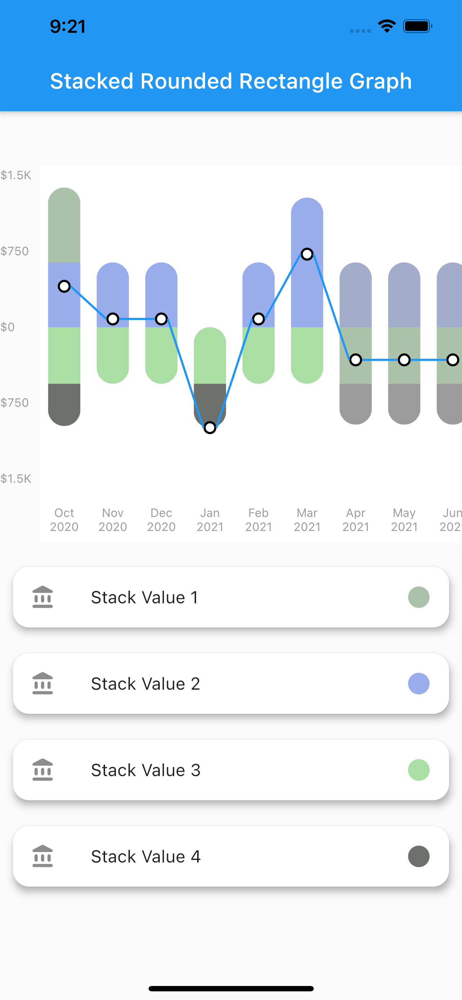
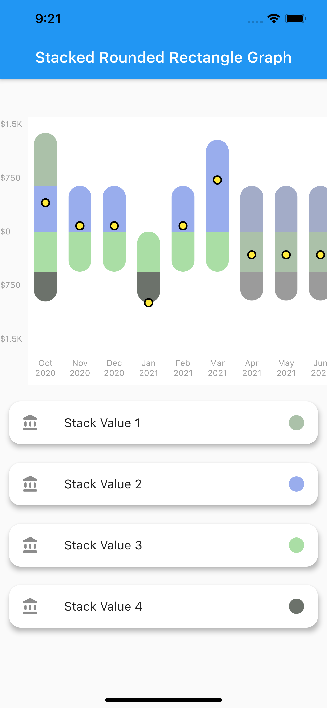

# stacked_bar_chart

A Flutter package for creating different types of charts.This package gives developer the flexibility to customize their graph as well.


## Features

1. Plot graphs 
    - Stacked Rounded Rectangle Graph
    - Stacked Rectangele Graph
    - Net Line Graph
    - Net Point Graph

2. Customize your graph
    - Select if you want to display the net line
    - change core color,line color as well as line width of the net line

3. Scrollable
    - The graphs plotted are scrollable

4. Provide data in json format
    - You can use the toMap() and forMap() methods to provide your data in json format

5. Style your Labels
    -You can style both you X-axis and Y-axis Labels.

## Installation

In the `dependencies:` section of your `pubspec.yaml`, add the following line:

```yaml
stacked_bar_chart:
```

Then `import` it as :

```yaml
import 'package:stacked_bar_chart/stacked_bar_chart.dart';
```

## Graph Types

1. Stacked Rounded Rectangle Graph
- A simple stacked bar graph  with  rounded borders.


- To plot this graph pass the `GraphType.StackedRounded` in `graphType`. as shown below 

```dart
graphType: GraphType.StackedRounded
```

You can also change the styling of the line and point plotted.The color,width etc. can be changed using the `netLine` parameter as :

```dart
netLine: NetLine(
                showPointOnly: false,
                showLine: true,
                lineColor: Colors.blue,
                pointBorderColor: Colors.black,
                coreColor: Colors.white,
              ),
```
.
.
.


2. Stacked Rectangle Graph

- A simple stacked bar graph  with no rounded borders. You can customize it in the same way as the stacked rounded rectangle graph.

- To plot this graph pass the `GraphType.StackedRect` in `graphType`. as shown below 

```dart
graphType: GraphType.StackedRect
```

.
.
.

3. Net Line Graph

- A simple line graph plotted with the net values of the data provided. The net values of a particular data is calculated and plotted.It can also be customized in the same way as stacked rounded rectangle graph.

- To plot this graph pass the `GraphType.StackedRect` in `graphType`. as shown below 

```dart
graphType: GraphType.LineGraph
```

.

    4. Net Point Graph

    A simple plot of the net values of the data.You can customize the point core and it's outer border using the `netPoint` parameter.

           To plot this graph pass the `GraphType.StackedRect` in `graphType`.  and then pass parameters in `netLine` to remove the line as shown below

```dart
graphType: GraphType.LineGraph
```

```dart
netLine: NetLine(
                showPointOnly: true,
                showLine: false,
                lineColor: Colors.blue,
                pointBorderColor: Colors.black,
                coreColor: Colors.white,
              ),
```

.
